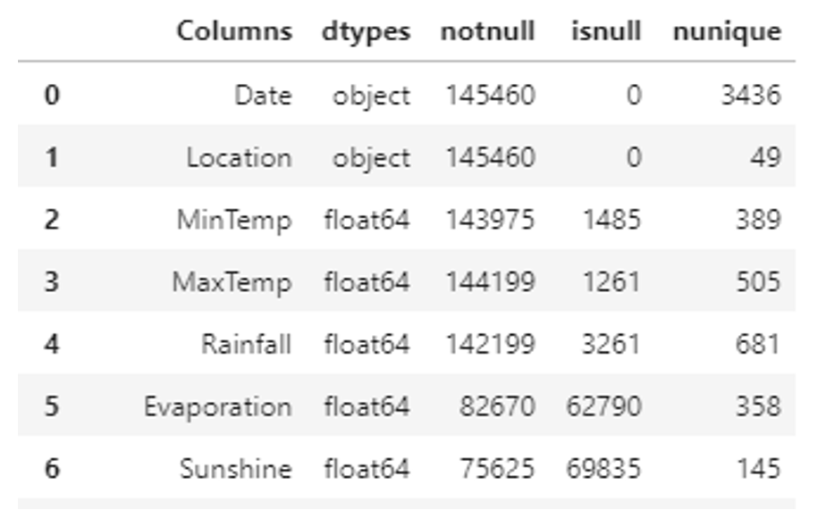

# Class4-Data_Analysis-Week18

Dataset link: https://www.kaggle.com/jsphyg/weather-dataset-rattle-package

1. Read the dataset as a dataframe.

2. Find out the `describe` and `info` attributes of the dataframe. Analyze these information and create a short write-up according to your findings.

3. Find out the `shape` and `size` info of the dataset.

4. Find out the `types` values of the columns and save the result as a dataframe.

5. Find out the `non-null` counts of the columns and save the result as a dataframe.

6. Find out the `null` counts of the columns and save the result as a dataframe.

7. Find out the `unique` counts of the columns and save the result as a dataframe.

8. Merge the dataframes you created in questions 4-5-6-7.
Expected output:


9. Lowercase all column names.

10. Change all the *No* values to *NoRain* and all the *Yes* values to *Rain* in `raintoday` and `raintomorrow` columns.

11. Change the data type of "date" (object) column to `datetime64` and reformat the date as `DD/MM/YYYY`.

12. Create a new column called "difference", calculate the difference between `maxtemp` and `mintemp` columns for each row, and store the value in this new column.

13. Remove the `evaporation` and `sunshine` columns from the dataset permanently.

14. Find out the most rainy day for each city.

15. Filter out all the data for the city 'Albury' and then sort according to `maxtemp` column.

16. Find out the `NaN` counts for each column.

17. Remove the rows with `NaN` values in "windgustdir" column from the dataframe permanently.

18. Create a new dataframe, use "Location" column as the index of the dataframe, display the `min`, `max`, and `median` values of "evaporation" and "sunshine" columns in this dataframe.

19. Find out the hottest day of "Perth". Example output:
```Timestamp('2015-01-05 00:00:00')```

20. Group your dataframe by location and find out the averages of all numeric values.

